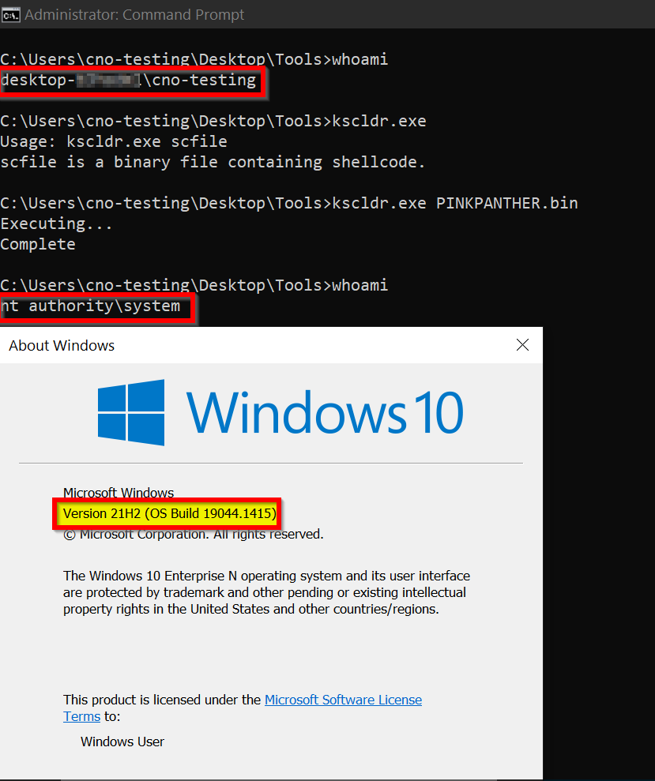

# PINKPANTHER

## Brief
`Windows` `x64` kernel-mode handcrafted shellcode to replace primary access token of executing process with `SYSTEM` process token for `Elevation of Privilege(EoP)`.

## Supported OS Versions
- `Windows 7/Windows Server 2008 R2 Build 7601`
- `Windows 8/Windows Server 2012 Build 9200`
- `Windows 8.1/Windows Server 2012 R2 Build 9600`
- `Windows 10 1507/TS1 Build 10240`
- `Windows 10 1511/TS2 Build 10586`
- `Windows 10 1607/RS1/Windows Server 2016 Build 14393`
- `Windows 10 1703/RS2 Build 15063`
- `Windows 10 1709/RS3 Build 16299`
- `Windows 10 1803/RS4 Build 17134`
- `Windows 10 1809/RS5/Windows Server 2019 Build 17763`
- `Windows 10 1903/19H1 Build 18362`
- `Windows 10 1909/19H2 Build 18363`
- `Windows 10 2004/20H1 Build 19041`
- `Windows 10 2009/20H2 Build 19042`
- `Windows 10 2104/21H1 Build 19043`
- `Windows 10 2110/21H2 Build 19044`

## Building and Deployment
The prerequisites for building this project are:
1. `Visual Studio 2019(any edition will do fine)`
2. `Windows 10 SDK, version 2004`
3. `Windows 10 WDK, version 2004`
4. `Python3`

It should be noted here that you can get away just by having an assembler(this project is using [MASM](https://docs.microsoft.com/en-us/cpp/assembler/masm/masm-for-x64-ml64-exe?view=msvc-170)) because technically that's all you need.

After installing the above, it should be as easy as opening the solution with `Visual Studio` and building for `x64` target.

After a successful build, binaries can be found inside the `Bin` directory under the appropriate bitness sub-directory.

Alternatively, you may download ready-to-deploy position independent shellcode from `Releases`.

Please do **NOT** try to deploy the payload on a machine that you rely on to get work done if you are unsure of how it works.

Refer to [Microsoft docs](https://docs.microsoft.com/en-us/windows-hardware/drivers/download-the-wdk) for any additional information.

## Testing
For testing purposes, I would highly recommend using [flare-kscldr](https://github.com/mandiant/flare-kscldr) to deploy the kernel-mode shellcode on a test `VM` and [CodeMachine System setup for kernel development and debugging guide](https://www.codemachine.com/articles/system_setup_for_kernel_development.html) to set up a `Hyper-V Guest VM` with full kernel debugging support.

Optionally, you may also consider automating the process with [kdbg-driver-vagrant](https://github.com/ioncodes/kdbg-driver-vagrant) to quickly spin up a test `VM` with full kernel debugging using [Vagrant](https://www.vagrantup.com/).

## Screenshots

## Caveats
As pointed out to me by Dmytro Oleksiuk([@d_olex](https://twitter.com/d_olex)), there are some not-so-subtle race conditions in the code specifically related to:
1. Manually walking `nt!_EPROCESS` structures linked together via circular doubly linked list without using some sort of synchronization primitive/locking mechanism
2. Unsafe referencing of these process objects while we are manipulating them

They are currently lacking any protection against changes being made to them while we are working on it.

Is this a problem? Yes, race conditions are always problematic and can cause all sorts of undefined behaviour/bugcheck unpleasantries.

Will using this payload affect the stability of my exploit? It might.

Well, what's the fix? The fix is two-step.

Part 1 involves acquiring a wait-type lock like Pushlocks - `nt!PspActiveProcessLock`(pushlock pointer) for exclusive access using [nt!ExAcquirePushLockExclusive](https://docs.microsoft.com/en-us/windows-hardware/drivers/ddi/wdm/nf-wdm-exacquirepushlockexclusive) before walking the process list(normal kernel `APC` delivery needs to be disabled beforehand) and [nt!ExReleasePushLockExclusive](https://docs.microsoft.com/en-us/windows-hardware/drivers/ddi/wdm/nf-wdm-exreleasepushlockexclusive) to release the lock once we are done using the list at which point normal kernel `APC` delivery should be reenabled.

However, since this global variable is not exported by `nt` kernel a much more decent and safe approach would be to use [nt!ZwQuerySystemInformation](https://docs.microsoft.com/en-us/windows/win32/sysinfo/zwquerysysteminformation) `API` with `SYSTEM_INFORMATION_CLASS == SystemProcessInformation` to find the `PID` from `ImageName` and [nt!PsLookupProcessByProcessId](https://docs.microsoft.com/en-us/windows-hardware/drivers/ddi/ntifs/nf-ntifs-pslookupprocessbyprocessid) to get `nt!_EPROCESS VA` from `PID`.

If you are curious though about how the kernel does the former, I'd request you to look at `nt!PsGetNextProcess` in a disassembler.

Part 2 involves safely referencing objects using [nt!ObReferenceObject](https://docs.microsoft.com/en-us/windows-hardware/drivers/ddi/wdm/nf-wdm-obfreferenceobject) family of `APIs` to increase the reference count on the process object so that it cannot be deleted until we explicitly decrement it at the end once we are done with it using [nt!ObDereferenceObject](https://docs.microsoft.com/en-us/windows-hardware/drivers/ddi/wdm/nf-wdm-obdereferenceobject).

Note that increasing the reference count manually is redundant since a call to [nt!PsLookupProcessByProcessId](https://docs.microsoft.com/en-us/windows-hardware/drivers/ddi/ntifs/nf-ntifs-pslookupprocessbyprocessid), if successful, does that for us.

Implementing these fixes, however, would require finding `ntoskrnl.exe` base address and resolving symbols therein by walking the `EAT` to find the function pointers using some string hashing algorithm all of which would dramatically increase payload size.

I might decide to implement that someday or just write in `C` and spam the compiler output :)

Thanks to Dmytro Oleksiuk([@d_olex](https://twitter.com/d_olex)) and Paul L.([@am0nsec](https://twitter.com/am0nsec)) for pointing out the error(s) and also suggesting the fix.

## Related Works
1. [Exploit Development: Panic! At The Kernel - Token Stealing Payloads Revisited on Windows 10 x64 and Bypassing SMEP](https://connormcgarr.github.io/x64-Kernel-Shellcode-Revisited-and-SMEP-Bypass/)
2. [Starting with Windows Kernel Exploitation – part 3 – stealing the Access Token](https://hshrzd.wordpress.com/2017/06/22/starting-with-windows-kernel-exploitation-part-3-stealing-the-access-token/)
3. [[Kernel Exploitation] 2: Payloads](https://www.abatchy.com/2018/01/kernel-exploitation-2)
4. [Windows Kernel Shellcodes - a compendium](https://www.matteomalvica.com/blog/2019/07/06/windows-kernel-shellcode/)
5. [Windows Kernel Shellcode on Windows 10 – Part 1](https://improsec.com/tech-blog/windows-kernel-shellcode-on-windows-10-part-1)
6. [Windows Kernel Shellcode : TokenStealer](https://amriunix.com/post/windows-kernel-shellcode-tokenstealer/)
7. [x64 Kernel Privilege Escalation](https://mcdcyber.wordpress.com/2011/03/07/x64-kernel-privilege-escalation/)